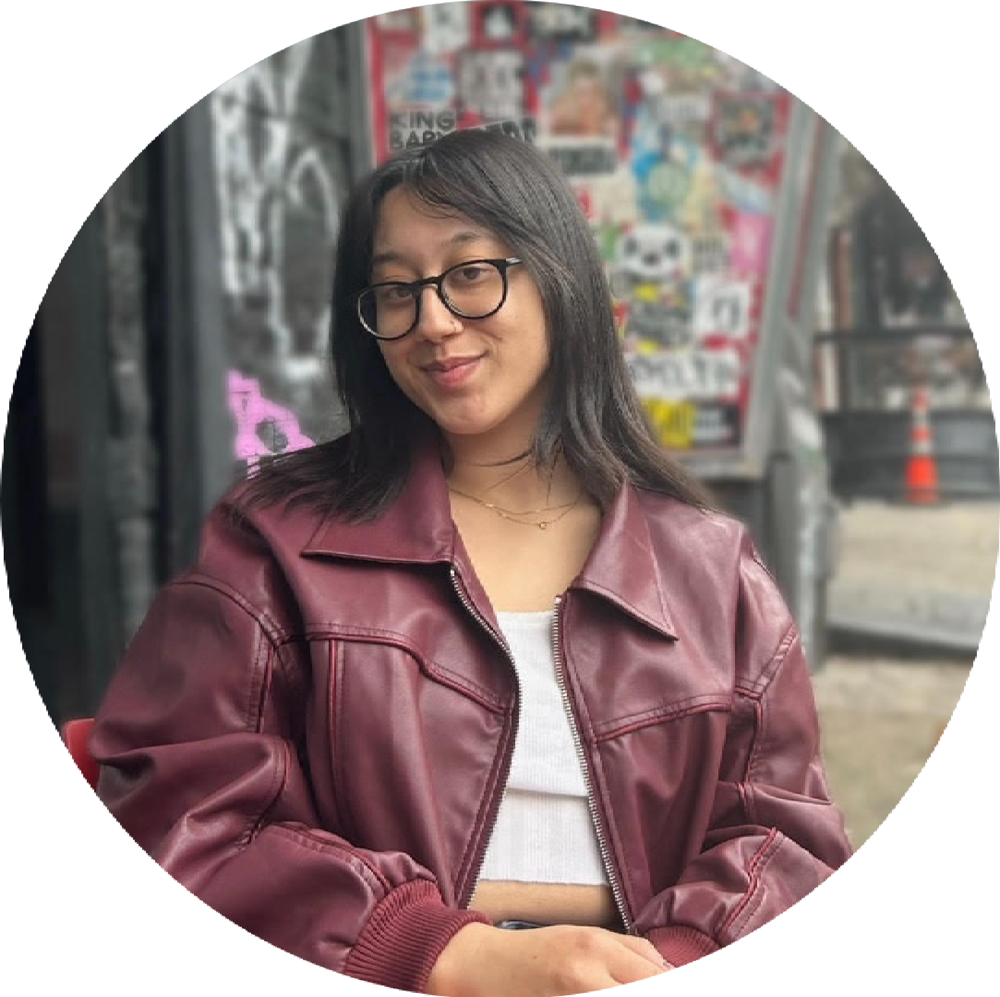

:::: {style="display: flex;"}

::: {}

{ width=75% }

:::

::: {}

### Megan Barkdull

I am an evolutionary biologist with an interest in the genetic basis and evolutionary consequences of complex traits in ants. I received my Ph.D. in Ecology and Evolutionary Biology at Cornell University. While there, I worked with [Dr. Corrie Moreau](http://www.moreaulab.entomology.cornell.edu/people/corrie-moreau/) to investigate patterns of molecular evolution associated with a variety of social traits in ants. 

In January 2025, I began as the Assistant Curator of Entomology at the [Natural History Museum of Los Angeles County](https://nhm.org), where I conduct research, oversee our collection of more than six million specimens, and work to expand our knowledge of the natural world through collaboration, mentorship, and outreach.

Learn more about my [research, curation, and outreach here](aboutMegan.html), find my [CV here](cv.html), or send me an email at mbarkdull [at] nhm [dot] org.

:::

::::

:::: {style="display: flex;"}

::: {}

{ width=75% }

:::

::: {}

### Dr. Austin Baker

Dr. Austin Baker is a postdoctoral scholar here at the NHMLAC, where he spearheads the state-funded California Insect Barcoding Initiative, a major multi-institutional effort to generate DNA barcodes for every insect species in the state. Austin holds a Ph.D. in Entomology from the University of California, Riverside, and his research interests are in insect systematics, evolution, biodiversity, and natural history. 
:::

::::

:::: {style="display: flex;"}

::: {}

{ width=75% }

:::

::: {}

### Yume Kamal

Yume Kamal is a Master's student at CSU Domiguez Hills, co-advised by myself and [Dr. Terry McGlynn](https://leaflitter.org). Yume is studying intraspecific variation in near-infrared reflectivity among ant species with widespread North American distributions. To do so, her work leverages museum specimens, imaging techniques, and bioinformatics. 

:::

::::

:::: {style="display: flex;"}

::: {}

{ width=75% }

:::

::: {}

### You?

Please contact me if you are interested in being a postdoctoral associate or undergraduate working on an independent project. I am particularly interested in working with prospective postdoctoral researchers to craft fellowship proposals (e.g. for the [NSF PRFB](https://new.nsf.gov/funding/opportunities/postdoctoral-research-fellowships-biology-prfb) or [La Kretz Fellowship](https://www.ioes.ucla.edu/lakretz/our-work/fellowships/)). 

:::

::::

