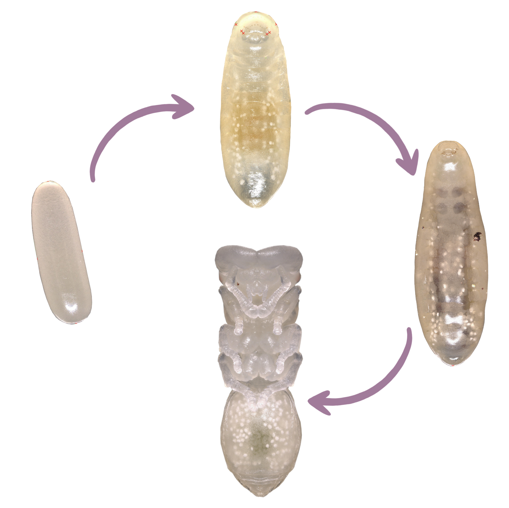
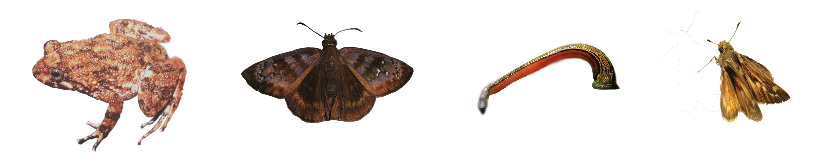

--- 
title: "Research"
output: 
  html_document:
    css: ['CSSBackgrounds.css', 'CSSFonts.css', 'styles.css']
    includes:
      after_body: footer.html
---

<!-- This hides the title "Research" from this page, since I wanted to have a display title that is different from the page title.  -->

## Current research

:::: {style="display: flex;"}

::: {}

:::

::: {}

### How can one genome produce multiple, highly divergent phenotypes?
In some ant species, multiple distinct adult morphologies can develop from a single genotype via developmental plasticity, producing polymorphic caste systems. You can see this in the movie to the right: the large-gastered queen and much smaller worker ants are genetically identical. My research leverages comparative genomics and developmental transcriptomics in the ant genus *Cephalotes* to better understand the genetic mechanisms which may produce ant castes. 

:::

::::

:::: {style="display: flex;"}

::: {}

{ width=90% }

:::

::: {}

### How does trait (de)coupling through development influence diversification?
Insects, particularly holometabolous insects, produce multiple phenotypes throughout their life cycle: eggs, larvae, pupae, and adults. If different life stages are adapted to different conditions and thus their traits are decoupled across development, this may promote diversification. Research in this area seeks to test this hypothesis, exploring whether trait decoupling does drive diversification and what kinds of traits are more or less likely to become decoupled. 
:::

::::

:::: {style="display: flex;"}

::: {}

{ width=90% }

:::

::: {}

### How do social traits influence genome-wide patterns of evolution?
We know that organismal traits, ranging from generation time to temperature preference, can influence genome evolution across generations. But how do **social** traits influence the genome? Ants are a great group in which to explore this question: they are descended from a single, social ancestor, but have tons of diversity in interesting social traits, like reproductive and caste systems. 

Here, I leveraged 22 ant genomes to understand how worker reproduction and worker caste polymorphisms modulate patterns of molecular evolution, both genome-wide and in candidate genes linked to this social traits. As predicted, worker reproduction is associated with an increase in selection intensity across the genome, but to our surprise, caste system has no clear effect on molecular evolution. Check out our paper in [Genome Biology and Evolution](https://academic.oup.com/gbe/advance-article/doi/10.1093/gbe/evad095/7181139) to learn more.  

:::

::::

<!-- This adds the floating gif of a Cephalotes colony to the right of the text.  -->

<!-- 
-->

## Past projects

### How can we use invertebrate-ingested DNA to answer conservation questions?
I previously worked with scientists at the American Museum of Natural History to determine which genes are most effective at identifying the vertebrate hosts of terrestrial bloodfeeding leeches, using DNA derived from the leech gut. I also examined the diversity of parasites harbored by the leeches in our dataset. For a PDF of the paper that came from this project, click [here](Siddall2019_IdeatingIDNA.pdf). 

A subsequent collaboration with scientists at the AMNH used bloodmeal DNA to determine the origin of leeches smuggled into the Toronto International Airport. For a PDF of the paper that came from this project, click [here.](Williams2020_CaughtRedHandedIDNAPointsToWil.pdf)

If you'd like to see the presentation on these projects that I gave in 2019, [click here](https://docs.google.com/presentation/d/1TbDIzi-b7nOzG2G7QPHbeaEBfXfC9GMWZradYekb4Tw/edit?usp=sharing). 

### How does population fragmentation impact butterfly population genetics?
With scientists at New College of Florida and the University of Florida, I contributed to conservation genetics studies of the federally-listed Dakota Skipper butterfly (Hesperia dacotae) and of the rare Florida Duskywing Skipper (Ephyriades brunnea), primarily working with [Dr. Emily Heffernan](https://www.ncf.edu/directory/emily-v-heffernan/). These projects used microsatellite markers to describe patterns of genetic drift, population isolation, and genetic diversity in each species. For a PDF of our publication on the Florida Duskywing, [click here](HeffernanEtAl2023.pdf).

